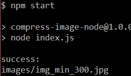

# compress-image-node.js
node.js compress image 

## 安装
1. 安装`graphicsmagick`，[官网](http://www.graphicsmagick.org)
2. 运行`npm i`

## 运行测试
`node index.js`或'npm start'

得到的结果是

## 文档
(gm)[https://www.npmjs.com/package/gm]
